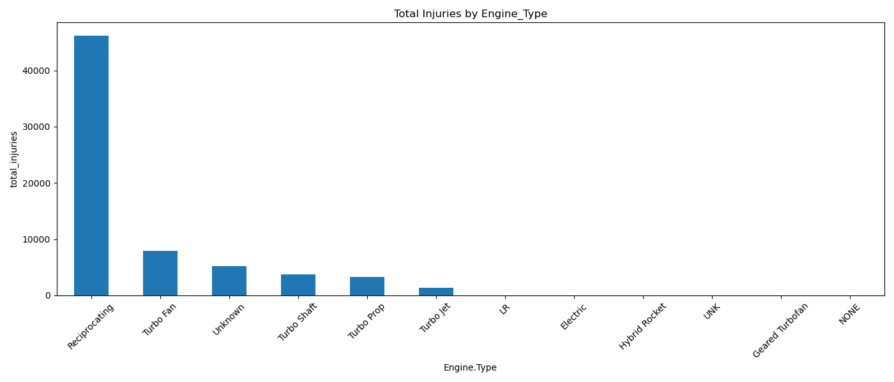
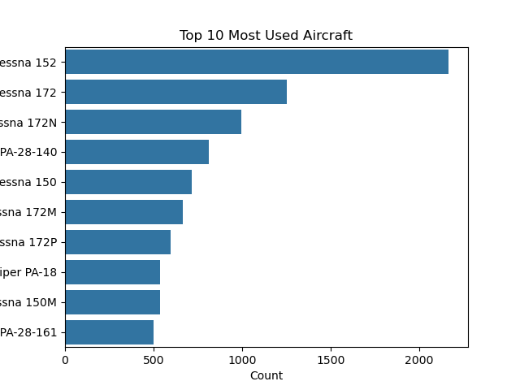
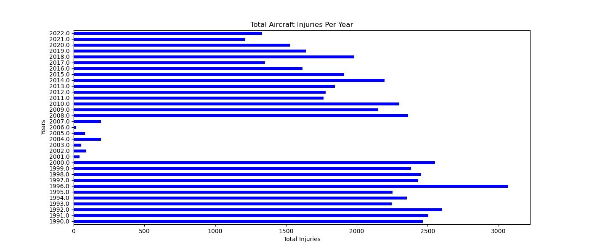

# Phase 1 Project README.md
## Overview
Data used was 'AviationData.csv'. The data has an encoding of 'windows-1252', with low_memory=false so as to prevent dtype misinfernce.
- The Event.Date was converted to datetime with error handling.
- The injury columns (Total.Fatal.Injuries, Total.Serious.Injuries, Total.Minor.Injuries) Was converted to numerical values.
- Total injuries computation was done by adding fatal,serious and minor injuries to give total_injuries.
- Created a combined Aircraft identifier, shown by (df['Aircraft'] = df['Make'].astype(str) + " " + df['Model'].astype(str)).
- Extracted accident Year from the Event.Date into a Years column.
- Computed top 10 countries with the highest total_injuries and displayed a horizintal bar chart, also , grouped Injuries by Make and Model.
- Identified the top 5 Aircraft makes with the highest total injuries and displayed injuries per time using bar charts or histograms.
- The trend was analyzed by filtering records from 1990 onwards and analyzed injuries per year per aicraft make to reveal safety improvements and risk patterns.
## Business Understanding
### StakeHolders
From the analysis done the stake holders are identified and their roles or intersts are shown as follows:
Aviation Safety Authorities - Understand risk patterns and enforce safety regulations.
Aircraft Manufucturers - Analyze if certain models or engine types are more accident prone.
Insurance Companies - Assess risk and set premiums based on the accident trends.
Policy Makers - Inform safety guidelines, weather protcals or aircraft use regulations.
Investigative Boards - Supprt root cause analysis with data trends.
Pilots and Unions - Advcate for safer practices and better equipment.
General Public - Transparency about risks and safety improvements.
### Key Business Questions
The questions the analysis helps to answer are:
Which aircrafts Make and Model are involved in the highest number of injury-related accidents?
How do the weather conditions influence the number of accidents?
Has the number of injuries increased or decreased over the years?
Are there certain phases of flights where accidents are more severe?
Are specific engine types associated with more injuries?
Are there clusters of accidents that show a recurring pattern?
Which country has the most injured related accidents?
## Data Understanding and analysis
The main data set used is AviationData.csv. It is sourced from Kaggle.
The format used is CSV, encoded in 'windows-1252'
The structure of the data is represented by an accident or incident involving and Aircraft.
Key columns used in the analysis are Event.Date, Make,Model, Country, Total.Fatal.Injuries,Total.Seriuos.Injuries, Total.Minor.Injuries, Broad.phase.of.flight, Weather.Condition, Engine.Type.
There is missing values Weather.Condition, Engine.Type and category like Broad.Phase.of.flight are sometimes vague or incosistent
Clustering: Used KMeans to find groups of similar incidents based on flight phase, weather, engine type, and injuries.
### Data Cleaning PerfOrmed
Converted date fields using pd.to_datetime.
Converted injury columns to numeric using pd.to_numeric.
Filtered data by year for trend analysis(1990-2022).
Created a derived column total_injuries = fatal + serious + minor.
Merged or created derived identifiers(Aircraft = Make + Model).
### Data Analysis
Data was explored and patterns were created:
#### Injury Analysis
The analysis was done by Country, Aircraft Make/Model, Flight phase, Weather condition and Engine type.

#### Trend Analysis
The analysis was done by Yearly injuries(1990-2022), Top 5 Aircraft makes over time(injury trends acrss year).

## Summary
Certain countries and aircraft Makes show higher injury rates.
Most injuries occur during landing or take off
Weather and engine type significantly affect accident severity